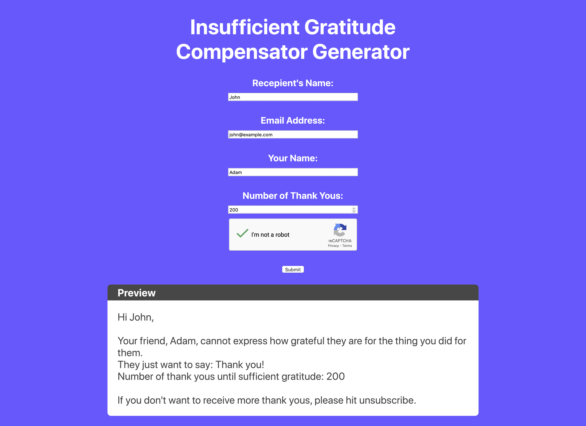

## I Cannot Thank You Enough

### The Idea
The whole thing came from my former boss, who sent me the following email:
> Magnificent!
>
>I cannot thank you enough.
>
>(However, if you go to ‘icannotthankyouenough.com’ and select ‘insufficient gratitude compensator generator’ and type in my details you’ll receive any shortfall of thanks over the next few months until the appropriate level of gratitude has been achieved.)

First I thought the site was real, but it turns out that it's just something he came up with. I decided to make it a reality. The finished site will send 'Thank you' emails to the recipient for a number of days specified by the sender.

### Status of Project
I've had a busy month, plus I'm inexperienced in web development so only the React front-end is presentable so far. I also worked on backend stuff, trying to figure out the email-sending capability server-side and such, but those are very much works in progress.

You can find a running version of the frontend at https://borntobegeek.me/ictye/.

### What I'm Proud Of
- I think the site looks neat.
- I've only learned a little bit of React from a video tutorial and I found it quite easy to make my idea real with that amount of knowledge.
- I love how the Preview area updates live as you type in the details. React is cool!
  
### What Needs Work
- Obviously the back-end, so far I'm not sure how to go about it, but I'm chipping away at the problems slowly.
- The whole idea is a bit fuzzy right now. So far I think the service will send one thank you email per day for a max duration of 365 days, with a huge 'Unsubscribe from these emails' button at the bottom of every email. We'll go from here.